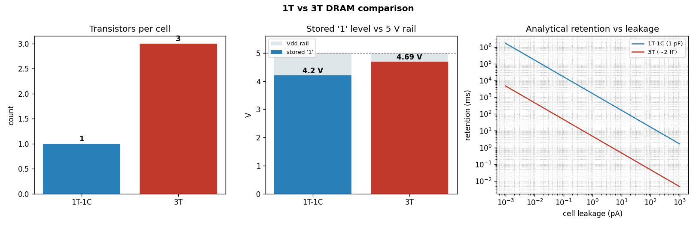

# 1T & 3T DRAM Cell Design and Analysis (Cadence Virtuoso)


Schematic design, transient simulation and quantitative comparison of the two
classic dynamic-memory bit-cells — the single-transistor **1T-1C** cell and the
**3T** cell — built and simulated in Cadence Virtuoso (Spectre) at a 5 V supply,
2 µm / 180 nm access devices.

The repository also ships a small, dependency-free Python model (`analysis/`)
and portable ngspice netlists (`spice/`) that reproduce the key measurements so
the results can be re-derived without the commercial PDK.

---

## Results at a glance

| Metric | 1T-1C | 3T |
|---|---|---|
| Transistors / cell | **1** (+ 1 storage cap) | 3 |
| Storage capacitance | 1 pF | ~2 fF (gate cap) |
| Stored `1` level (measured) | **4.2 V** | **4.69 V** |
| Threshold drop on write-`1` | 0.8 V | 0 V |
| Stored charge `Q = CV` | 4.2 pC | 9.4 fC |
| Write energy `C·Vdd²` | 25 pJ | 50 fJ |
| Read type | destructive | **non-destructive** |
| Bit-line read swing (measured) | ~15 mV | full-rail |
| Sense amplifier | required | not required |

**Key finding:** the 1T pass transistor loses one threshold voltage when writing
a `1`, so the cell holds **4.2 V instead of the full 5 V rail** and its read is
destructive with only a ~15 mV bit-line swing — maximum density at the cost of a
sense amplifier and refresh. The 3T cell reads non-destructively at full rail
(4.69 V) for roughly **3× the cell area**.



---

## Schematics and waveforms

| 1T-1C cell | 3T cell |
|---|---|
|  |  |

**1T write operation** — storage node charges to ~4.2 V for a `1` and ~0.9 V for
a `0` (note the one-Vt loss through the NMOS pass device):


**1T read operation** — small (~15 mV) charge-sharing swing on the bit line:


**3T write / hold** — storage node stays near full rail (4.69 V) and read is
non-destructive:


---

## Repository layout

```
.
├── 1T DRAM.png / 3T DRAM.png            schematics captured from Virtuoso
├── *test circuit.png                    testbench schematics
├── Write op_*/Read op_* .png            transient simulation waveforms
├── analysis/dram_analysis.py            quantitative comparison + figure
├── spice/
│   ├── dram_1t.sp                        portable 1T-1C ngspice deck
│   ├── dram_3t.sp                        portable 3T ngspice deck
│   └── nmos_generic.inc                  generic NMOS model card
└── results/dram_comparison.png          generated figure
```

## Reproducing the results

```bash
# quantitative table + comparison figure (needs Python + matplotlib)
python3 analysis/dram_analysis.py --plot

# transient sims with a generic model (needs ngspice)
ngspice -b spice/dram_1t.sp
ngspice -b spice/dram_3t.sp
```

The ngspice decks use a generic level-1 model so they run without the foundry
PDK; swap in the PDK card in `nmos_generic.inc` to match the Spectre corners.

## Concepts covered

- Charge-storage memory operation, destructive vs non-destructive read
- Threshold-voltage loss through NMOS pass transistors
- Charge sharing and bit-line sensing
- Retention / refresh and the density-vs-robustness trade-off
- Schematic capture and transient analysis in Cadence Virtuoso
